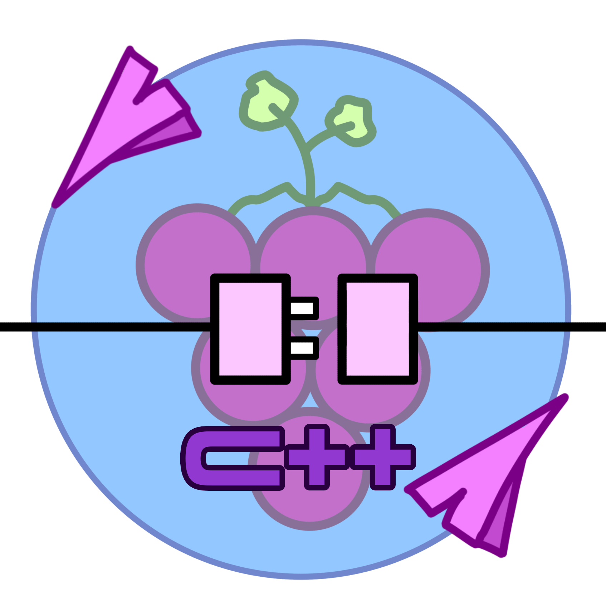

<p align="center"></p>

<h1 align="center">Microsoft  Activation  Scripts (MAS)</h1>

<p align="center">A Windows and Office activator using HWID / Ohook / KMS38 / Online KMS activation methods, with a focus on open-source code and fewer antivirus detections.</p>
<hr>

# ARCHANABERRYWAWSPP/BAILEYS

# Achana Berry WhatsApp WebSocket C++ Baileys



Archana Berry WhatsApp WebSocket C++ Baileys adalah perpustakaan untuk berkomunikasi program client WhatsApp ke server dengan websocket C++ secara realtime yang powerful dan user-friendly untuk pengembangan aplikasi C++. Dengan antarmuka yang intuitif dan kinerja optimal, Baileys mempercepat proses pengembangan Anda tanpa mengorbankan kehandalan, dan begitu mudah pengerjaan nya.

## Archana Berry WhatsApp WebSocket C++

[Archana Berry WhatsApp WebSocket C++](link_library) adalah sebuah library C++ yang memungkinkan akses ke WhatsApp API melalui WebSocket. Library ini dirancang untuk memudahkan pengembang dalam mengintegrasikan fitur WhatsApp ke dalam aplikasi mereka menggunakan bahasa pemrograman C++.

### Fitur Archana Berry Baileys 

- Autentikasi Multi Perangkat (Multi-Device)
- Tidak Memerlukan Selenium atau Chromium
- Instalasi yang stabil
- Kirim pesan broadcast
- Kirim pesan secara private maupun group
- Membaca pesan
- Membaca status
- Kirim gambar
- Kirim video
- Kirim audio
- Kirim catatan suara (Voice Note/VN)
- Kirim stiker
- Kirim dokumen apapun format nya hingga 2Gb (2000Mb not 2048Mb) kurang segitu lebih baik!
- Membaca pesan masuk secara private maupun group
- Kirim pesan bisnis
- Kirim alamat peta
- Kirim video bulat
- Ubah poto profile
- Ubah bio profile
- Masuk via ponsel
- Membuat saluran
- Ikuti saluran
- Batal ikuti saluran
- Kirim panggilan
- Terima panggilan
- Tolak panggilan
- Dapatkan permintaan anggota
- Terima permintaan anggota
- Tolak permintaan anggota
- Kirim pesan polling
- Hapus pesan
- Edit pesan
- Enkripsi pesan
- Dekripsi pesan

## Status Pengembangan Fitur
- Perlu diingat saat ini masih tahap pengembangan mungkin belum sepenuhnya stabil TwT

| Fitur  | Status |
| ------------- | ------------- |
| Login lewat ponsel | ✅ |
| Multi Perangkat | ✅ |
| Membuat Saluran | ✅ |
| Ikuti saluran | ✅ |
| Batal ikuti saluran | ✅ |
| Kirim pesan polling | ✅ |
| Baca status cerita | ✅ |
| Dapatkan status cerita | ✅ |
| Kirim panggilan | ✅ |
| Terima panggilan | ✅ |
| Tolak panggilan | ✅ |
| Dapatkan permintaan anggota | ✅ |
| Terima permintaan anggota | ✅ |
| Tolak permintaan anggota | ✅ |
| Dan lain lain... | ✅ |

## Cara pemperbarui program
Anda harus menuliskan seperti ini di terminal!
```
$> make
```

secara otomatis akan dikompilasi dan mengupdate program dari kode program yang anda buat sebelumnya.

## Penggunaan

Berikut adalah contoh penggunaan sederhana:

```cpp
#include <archanaberrywspp/baileys.hpp>
// Code example here

//
